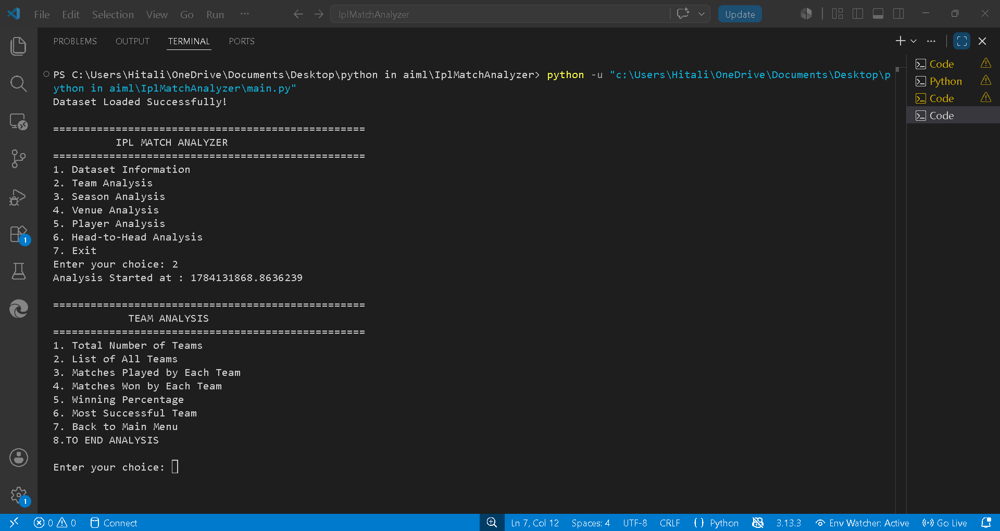
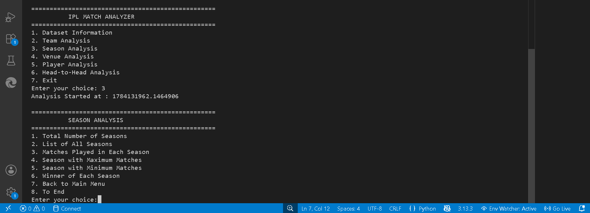
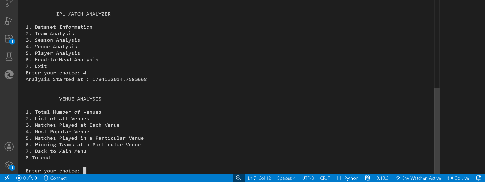
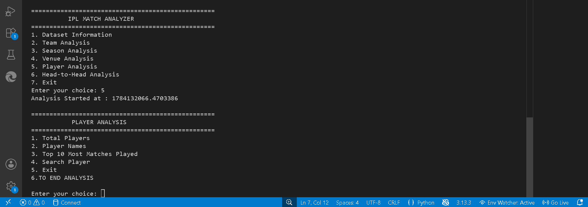

# 🏏 IPL Match Analyzer

A Python-based command-line application that analyzes IPL match data using **Pandas**. It provides detailed insights into teams, players, venues, seasons, and head-to-head records through a simple menu-driven interface.

---

## 📌 Features

- 📊 Display Dataset Information
- 🏏 Team Analysis
- 📅 Season-wise Analysis
- 🏟️ Venue Analysis
- 👤 Player Analysis
- 🤝 Head-to-Head Analysis
- ⏱️ Execution Time Logging using Python Decorators
- 💻 User-Friendly Menu-Driven Interface

---

## 🛠️ Tech Stack

- **Language:** Python
- **Libraries:** Pandas, NumPy
- **IDE:** Visual Studio Code
- **Version Control:** Git & GitHub

---

## 📂 Project Structure

```
IplMatchAnalyzer/
│
├── data/
│   └── matches.csv
│
├── screenshots/
│   ├── menu.png
│   ├── dataset_info.png
│   ├── team_analysis.png
│   ├── season_analysis.png
│   ├── venue_analysis.png
│   ├── player_analysis.png
│   └── head_to_head.png
│
├── analyzer.py
├── decorators.py
├── main.py
├── requirements.txt
├── README.md
└── .gitignore
```

---

## 🚀 Installation

### Clone the repository

```bash
git clone https://github.com/HiteX28/IplMatchAnalyzer.git
```

### Go to the project directory

```bash
cd IplMatchAnalyzer
```

### Install the required libraries

```bash
pip install -r requirements.txt
```

### Run the application

```bash
python main.py
```

---

## 📋 Main Menu

```
==================================================
          IPL MATCH ANALYZER
==================================================

1. Dataset Information
2. Team Analysis
3. Season Analysis
4. Venue Analysis
5. Player Analysis
6. Head-to-Head Analysis
7. Exit
```

---

# 📸 Screenshots

## 🏠 Main Menu


---

## 📊 Dataset Information


---

## 🏏 Team Analysis



---

## 📅 Season Analysis



---

## 🏟️ Venue Analysis



---

## 👤 Player Analysis



---

## 🤝 Head-to-Head Analysis


---

## 📊 Analysis Included

### 📌 Dataset Information
- Total Matches
- Total Seasons
- Teams Participated
- Number of Venues
- Missing Values

### 🏏 Team Analysis
- Total Wins
- Matches Played
- Win Percentage
- Toss Statistics

### 📅 Season Analysis
- Matches Played Per Season
- Season Winners
- Seasonal Statistics

### 🏟️ Venue Analysis
- Matches Played at Each Venue
- Most Successful Teams
- Venue-wise Records

### 👤 Player Analysis
- Player of the Match Awards
- Top Performing Players
- Player Statistics

### 🤝 Head-to-Head Analysis
- Total Matches Between Two Teams
- Wins by Team 1
- Wins by Team 2
- No Result Matches

---

## 📈 Future Enhancements

- 📊 Interactive Graphs using Matplotlib
- 🌐 Streamlit Web Application
- 🤖 Match Winner Prediction using Machine Learning
- 📉 Team Performance Dashboard
- ☁️ Cloud Deployment

---

## 📦 Requirements

```
pandas
numpy
```

---

## 👨‍💻 Author

**Hitesh Mahajan**

- GitHub: https://github.com/HiteX28
- Repository: https://github.com/HiteX28/IplMatchAnalyzer

---

## ⭐ Support

If you found this project useful, consider giving it a ⭐ on GitHub.

It motivates me to build more Python and Data Analysis projects.

---